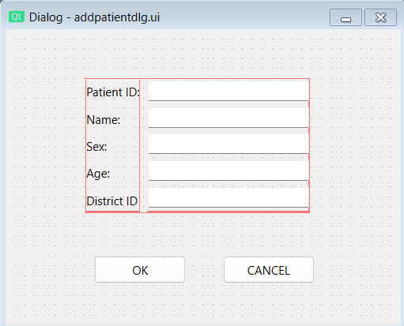
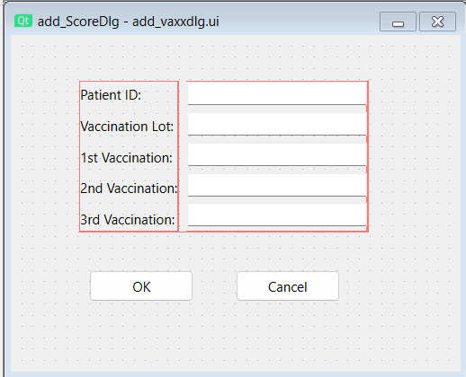
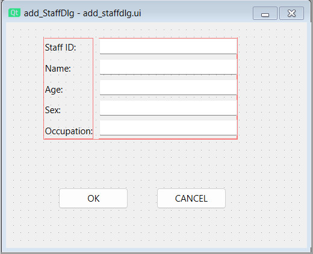
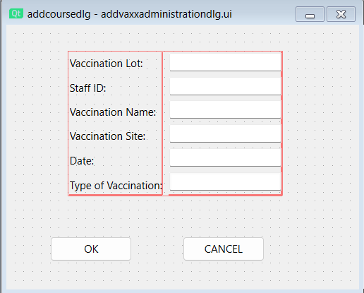
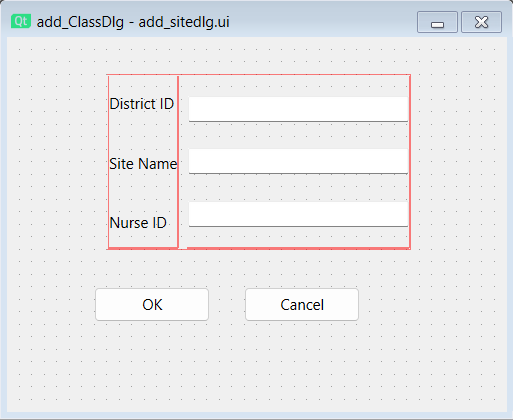
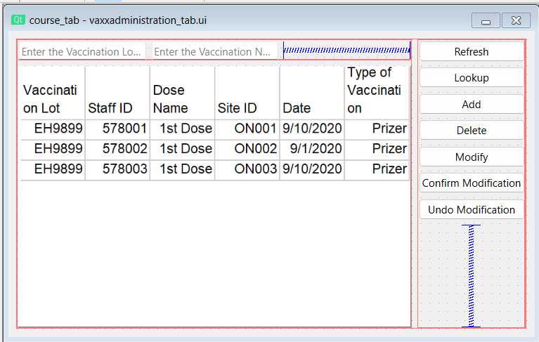
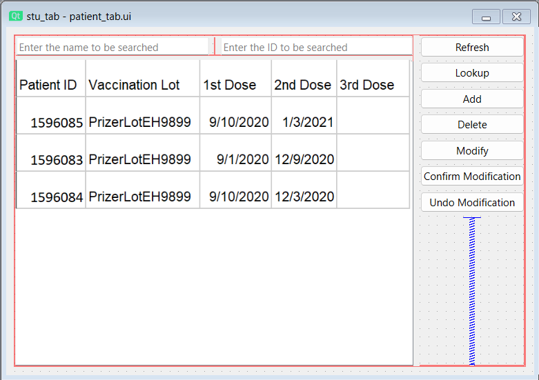
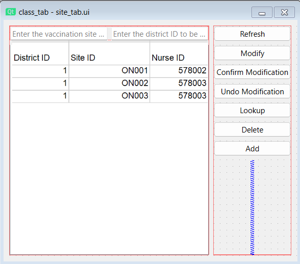
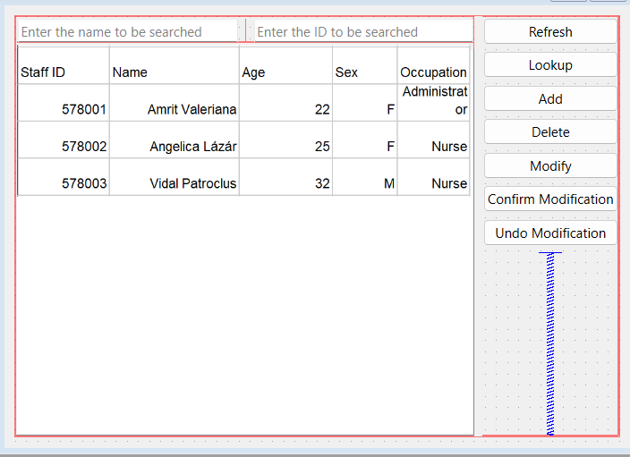
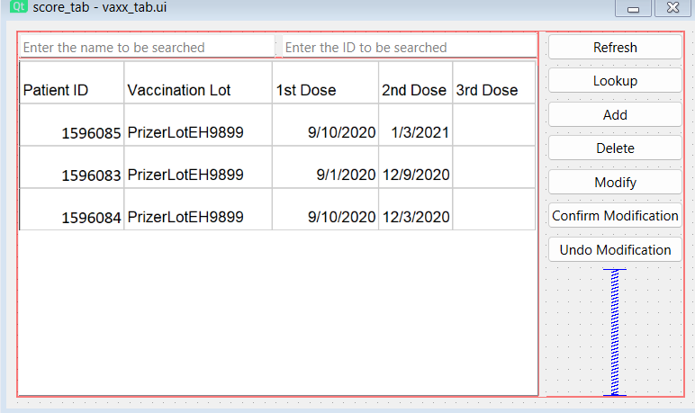

# Vaccination-Management-System

Database Management Systems Project

Languages: C++ and Qt

Database: MySQL

## ER Diagram

## Add New Patient

## Add New Vaccination Info

## Add New Staff

## Add New Patient

## Add New Vaccination Site

## Patient Look Up

## Vaccination Info Look Up

## Staff Look Up

## Patient Look Up

## Vaccination Site Look Up

## Summary
Our project can help :

- Government
- Hospitals
- Citizens
The project highlights the use of :

- Techniques for system analysis and design, such as data flow diagrams
- Database handling and query processing.
- Database Designing.
- User interface design
- Several features that make the application easier to use